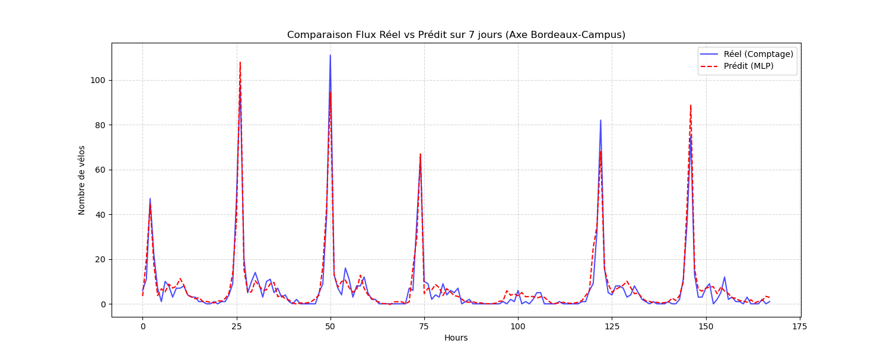

# CycloPredict - Prédiction des Flux Cyclistes

## Présentation
Estimation du trafic cycliste entre la Barrière de Toulouse (Bordeaux) et Haut-Lévêque (Pessac). Ce projet permet d'anticiper la fréquentation sur cet axe universitaire.

## Données
Les données proviennent de l'**Open Data de Bordeaux Métropole**. Nous utilisons les comptages des stations Totem et Haut-Lévêque.

## Méthode
Le modèle est un réseau de neurones qui s'appuie sur :
* L'heure et le jour de la semaine.
* Le calendrier des jours fériés (via la librairie `holidays`).
* Le trafic observé une heure et un jour auparavant.

## Résultats
Le modèle MVP affiche les scores suivants :
* **MAE** : 2.39 (erreur moyenne de ~2 vélos par heure).
* **RMSE** : 4.65.



## Bibliothèques utilisées
* pandas
* scikit-learn
* matplotlib
* requests
* joblib
* holidays

## Installation et Usage
L'installation et le lancement sont automatisés via le **Makefile** :

```bash
make setup  # Installer les dependances
make run    # Lancer le projet
